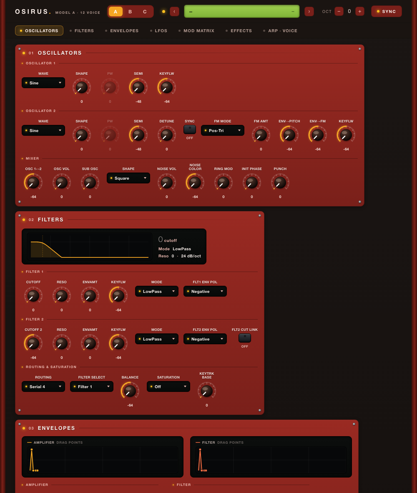

# Move Everything: Osirus

Access Virus synthesizer emulation for [Schwung](https://github.com/charlesvestal/move-everything) on Ableton Move hardware. Named "Osirus" after [Gearmulator's Virus emulation](https://github.com/dsp56300/gearmulator).

Uses the [Gearmulator](https://github.com/dsp56300/gearmulator) DSP56300 JIT emulator to run the original Virus firmware.

## Requirements

- Move Everything host installed on your Ableton Move
- A Virus A ROM file (`.mid` format) — not included

## Installation

Install via the Module Store on your Move, or manually:

```bash
./scripts/build.sh
./scripts/install.sh
```

Then place your Virus ROM file in the module's `roms/` directory on the device:
```
/data/UserData/move-anything/modules/sound_generators/osirus/roms/
```

## Supported ROMs

- **Virus A** (`.mid` boot ROM format) — recommended, tested on Move hardware

Example filenames: `First_A_28.mid` (OS + factory presets), `second_A_28.mid` (preset bank)

The loader accepts any `.mid` or `.bin` file in the `roms/` directory. It auto-detects the model (A/B/C) from the firmware version string inside the ROM. Place both the OS file and preset file together — they will be combined automatically. If you have multiple ROMs, you can switch between them in the Settings menu.

Virus B/C ROMs are not supported on Move. The Virus B/C DSP models require more processing power than the Move's Cortex-A72 can provide in real time.

User presets are supported: a patch saves and recalls as self-contained state, so the host's **User Presets** (including live preview) work with Osirus — in addition to the ROM's built-in banks.

## Architecture

The DSP emulator runs in a **forked child process** to avoid sharing kernel resources (mmap_lock, heap allocator) with MoveOriginal. Communication between the plugin API and the DSP child uses shared memory:

- **Audio**: Lock-free ring buffer (8192 frames, target fill ~384 frames / 9ms)
- **MIDI**: FIFO queue in shared memory
- **Control**: Atomic flags for status, preset info, and profiling

The DSP56300 JIT compiler translates Motorola DSP56300 instructions to ARM64 (aarch64) machine code at runtime using [asmjit](https://github.com/asmjit/asmjit).

## Signal Chain Integration

Works as a sound generator in Move Everything's Signal Chain. Exposed parameters:

- Filter: Cutoff, Resonance, Filter Env Amount, Filter Mode
- Filter Envelope: Attack, Decay, Sustain, Release
- Amp Envelope: Attack, Decay, Sustain, Release
- Oscillators: Osc1 Shape, Osc2 Shape, Osc Balance, Volume

Preset browsing supports 8 banks x 128 presets.

On-device controls:

- **Jog wheel** or **Left/Right**: previous/next preset
- **Shift + Left/Right**: previous/next bank
- Scrolling past the first/last preset automatically wraps to the previous/next bank

## Remote UI

A browser-based editor is served by the host for full patch editing (open it from the slot's custom-UI button). It lays the Virus parameters out by signal flow, auto-skins itself to the detected ROM model, and renders live instrument graphics:



- Scrollable sections — Oscillators → Filters → Envelopes → LFOs → Mod Matrix → Effects → Arp·Voice
- A live filter-response (Bode) plot and drag-editable ADSR envelope graphs
- A readable mod matrix (Source → Destination → Amount) with draggable bipolar amount bars
- Ring knobs (vertical drag / wheel / double-click to reset), select chips, and hardware-style toggles
- Model-aware: it shows only the parameters the loaded ROM model actually has, and re-skins per model (A / B / C)

## Building

Requires Docker for cross-compilation:

```bash
./scripts/build.sh    # Build via Docker (Ubuntu 22.04 + aarch64 toolchain)
```

Output: `dist/osirus/dsp.so` (ARM64 shared library)

## Credits

- [dsp56300/gearmulator](https://github.com/dsp56300/gearmulator) — DSP56300 emulator and Virus synth library
- [asmjit](https://github.com/asmjit/asmjit) — JIT assembler for ARM64/x86-64

## License

GPL-3.0 (following gearmulator's license)

## AI Assistance Disclaimer

This module is part of Move Everything and was developed with AI assistance, including Claude, Codex, and other AI assistants.

All architecture, implementation, and release decisions are reviewed by human maintainers.  
AI-assisted content may still contain errors, so please validate functionality, security, and license compatibility before production use.

## Changelog

**Remote UI**
- New signal-flow remote editor (replaces the old panel): scrollable sections, a live filter-response plot, drag-editable ADSR envelopes, and a readable Source → Destination → Amount mod matrix.
- Auto-skins to the detected ROM model (A red/amber, B indigo, C charcoal) and shows only the parameters that model has.

**Synth / engine**
- Automatic ROM-model (A/B/C) detection, driving the remote-UI skin and parameter gating.
- User presets — self-contained patch save/restore that works with the host's User Presets and live preview; patches recall faithfully across set reloads.
- 4-point cubic output resampler for cleaner audio than the previous linear resampler.
- DSP-clock control to trade emulation headroom for CPU on heavier ROMs.

**Robustness & fixes**
- The DSP child process is monitored: if it crashes mid-session the module auto-recovers (respawns) instead of going permanently silent.
- No more stuck notes when changing octave transpose while keys are held.
- Stronger panic — All Notes Off also releases the sustain pedal and forces All Sound Off.
- Cross-process audio/MIDI memory-ordering fences (ARM) to prevent rare glitches and torn state.
- DSP-clock % now persists correctly; Virus-A FX parameter gating corrected; assorted state-restore fixes.
